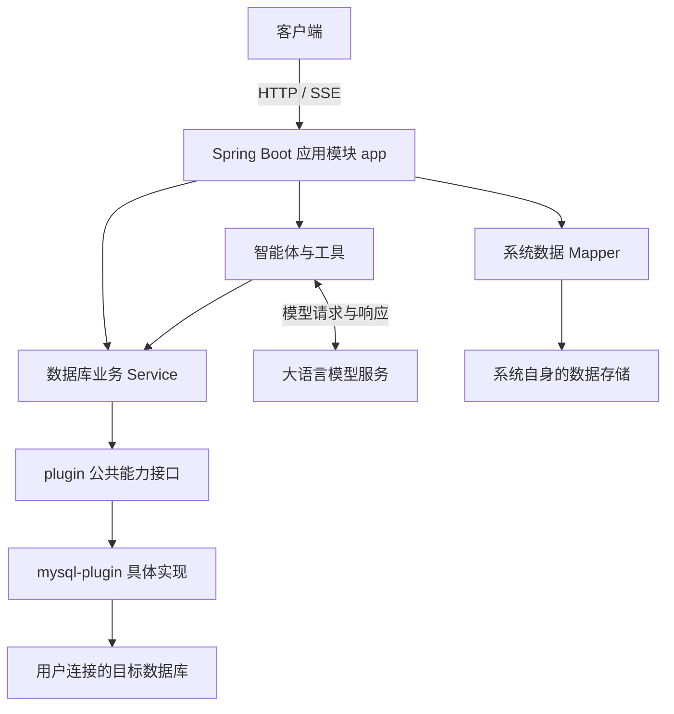
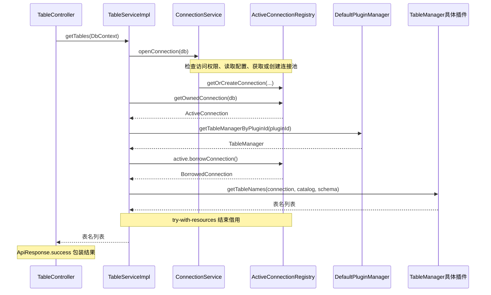

# Data-Agent 项目架构说明（后端）

本文面向新加入项目的开发人员，重点说明代码职责、调用关系和扩展位置，不按产品功能逐项介绍。

核对日期：2026-09-15。内容以当前工作区源码为依据，包含尚未提交的表重命名相关代码；不代表已发布版本或所有能力都经过端到端验证。达梦接入属于后续扩展方案，当前 `DbType` 枚举仅有 MySQL，具体插件为 MySQL 5.7 和 MySQL 8。

## 1. 整体架构

项目采用 React 前端与 Spring Boot 后端分离的结构。后端由应用业务模块、数据库插件公共模块和具体数据库插件组成；智能体运行在应用业务模块内，通过工具调用已有数据库服务。



图中的箭头表示调用关系。编译依赖方向有所不同：具体数据库插件依赖公共模块，从而实现公共模块声明的接口。

主要技术基础：Java 17、Spring Boot、Maven 多模块、MyBatis-Plus、JDBC、LangChain4j，以及用于聊天流式响应的 Reactor `Flux` 与 SSE。具体版本以父工程和子模块 POM 为准。

## 2. Maven 模块与职责

```text
Data-Agent-Server/
├── pom.xml                         父工程：依赖版本与模块组织
├── data-agent-server-app/           可运行应用与业务逻辑
├── data-agent-server-plugin/        数据库插件公共层
└── data-agent-server-plugins/       具体插件聚合模块
    └── mysql-plugin/               MySQL 实现
```

| 模块 | 职责 | 常见修改场景 |
|---|---|---|
| 父工程 | 统一依赖版本，声明模块 | 调整依赖、增加模块 |
| `app` | HTTP 入口、业务编排、权限、连接资源管理、智能体、系统数据持久化 | 改业务流程、接口、智能体行为 |
| `plugin` | 插件身份、能力接口、公共模型、基础实现、插件发现与查找 | 增加公共能力或调整公共约定 |
| `plugins/mysql-plugin` | MySQL 连接、元数据、SQL 与对象操作适配 | 修改 MySQL 特有语法或行为 |

`app` 的 POM 依赖公共模块，并通过 `data-agent-server-plugins` 的 POM 依赖引入具体插件。公共层不是一份需要复制的模板，而是各插件共同依赖的 Java 代码。

职责分离是整体设计原则，并非所有数据库类型相关代码都已完全隔离。例如 `app` 的驱动存储处理仍存在 `DbType.MYSQL` 引用，公共模块也有 `MysqlIdentifierEscaper`。新增数据库时应检查这些假设。

## 3. app 内部代码分层

Java 包根目录为 `data-agent-server-app/src/main/java/edu/zsc/ai`。

| 目录 | 职责 |
|---|---|
| `api/controller` | 接收 HTTP 请求、参数校验、调用服务、响应包装 |
| `api/model/request`、`domain/model` | 请求、响应、实体及上下文模型；当前请求模型存在两处组织方式 |
| `domain/service/db` | 数据库连接、元数据、SQL 执行等业务接口与实现 |
| `domain/service/agent` | 聊天会话准备、上下文组织、流式响应桥接 |
| `domain/service/ai` | 会话、消息、记忆、压缩、导出等服务 |
| `domain/service/permission` | 权限规则相关业务 |
| `domain/mapper` | 访问系统自身保存的数据 |
| `agent` | 主智能体约定、工具、记忆适配、子智能体、执行约束 |
| `config/ai` | 模型、智能体、工具、记忆相关装配 |
| `context`、`aspect` | 请求及智能体上下文、切面支持 |
| `common`、`util` | 公共定义、转换与工具代码 |

### 三种“接口”的区别

| 例子 | 调用者 | 约定的内容 |
|---|---|---|
| `GET /api/tables` | HTTP 客户端 | 路径、请求参数、返回格式 |
| `TableService` | Controller 等后端代码 | 应用业务操作，例如根据 `DbContext` 获取表列表 |
| `TableManager` | `TableServiceImpl` 等业务实现 | 使用 JDBC 连接完成表操作的数据库能力 |

`TableService` 组织连接、权限和插件调用；`TableManager` 使用已取得的连接执行操作。二者按不同职责变化，因此分别维护。

## 4. 数据库插件公共能力

能力接口主要位于 `plugin/capability`。

| 接口 | 当前约定的主要能力 |
|---|---|
| `ConnectionManager` | 连接、测试、关闭及数据库/驱动信息 |
| `DatabaseManager` | 数据库列表、删除数据库 |
| `SchemaManager` | schema 列表 |
| `TableManager` | 表列表、搜索、计数、DDL、删除与重命名、数据读取、插入和删除行 |
| `ViewManager` | 视图列表、搜索、计数、DDL、删除及数据读取 |
| `ColumnManager` | 字段元数据 |
| `IndexManager` | 索引元数据 |
| `FunctionManager` | 函数列表、搜索、计数、DDL、删除 |
| `ProcedureManager` | 存储过程列表、搜索、计数、DDL、删除 |
| `TriggerManager` | 触发器列表、搜索、DDL、删除 |
| `CommandExecutor` | 执行命令；SQL 插件可使用 SQL 请求与结果模型 |
| `SqlSplitter` | 将 SQL 文本拆成多条语句 |
| `SqlValidator` | SQL 校验与类型识别 |
| `SqlIdentifierEscaper` | 标识符引用、字符串与 LIKE 模式转义 |

其他公共约定包括 `Plugin`、`SqlPlugin`、`NoSqlPlugin`、`PluginManager`，以及连接构建、数据值处理、命令请求与结果接口。`SqlPlugin` 描述是否支持 catalog 和独立 schema 等概念；存在 `NoSqlPlugin` 并不表示当前已有非关系型数据库完整实现。

能力接口不等于已实现全部功能，也不等于完整 CRUD。默认方法有两种常见形式：

- 可复用实现：例如 `TableManager.searchTables()` 使用 JDBC `DatabaseMetaData.getTables()`。
- 不支持占位：例如部分方法默认抛出 `UnsupportedOperationException`，具体插件需要重写后才能使用。

注册管理器检查插件是否实现能力接口，并不能替代逐个方法的功能验证。

## 5. MySQL 如何实现公共接口

`mysql-plugin` 通过 Maven 依赖公共模块，然后通过 Java 的 `implements`、`extends` 和方法委托实现能力。

```text
Mysql8Plugin
  extends DefaultMysqlPlugin
    extends AbstractDatabasePlugin（实现 SqlPlugin）
    implements TableManager、ViewManager、ConnectionManager 等
      ├── 委托 MysqlTableManager
      ├── 委托 MysqlViewManager
      └── 委托其他具体能力实现
```

`DefaultMysqlPlugin` 对外集中提供插件能力，内部由不同 Manager 承担具体工作。`Mysql8Plugin` 和 `Mysql57Plugin` 继承共用代码，并提供各自的插件描述和驱动信息。

以表列表为例：

```text
TableServiceImpl
 → 以 TableManager 类型调用 Mysql8Plugin
 → 继承的 DefaultMysqlPlugin.getTableNames()
 → 委托 MysqlTableManager
 → 复用 TableManager 的默认 JDBC 元数据查询
```

获取表 DDL 等数据库特定行为则由 `MysqlTableManager` 重写，并使用 MySQL SQL 模板。新增其他数据库时，应复用适用的默认实现，并对差异方法提供专用实现。

## 6. 插件发现与选择

### 6.1 Java SPI 发现

MySQL 模块包含文件：

```text
src/main/resources/META-INF/services/edu.zsc.ai.plugin.Plugin
```

文件声明：

```text
edu.zsc.ai.plugin.mysql.Mysql57Plugin
edu.zsc.ai.plugin.mysql.Mysql8Plugin
```

`DefaultPluginManager` 初始化时执行 `ServiceLoader.load(Plugin.class)`，加载运行时类路径上的插件，并按插件 ID、数据库类型建立映射。

`@PluginInfo` 提供插件 ID、数据库类型和支持版本等描述；SPI 文件负责声明实现类。仅添加注解或 Java 类，不足以完成接入。当前加载方式也不应直接理解为支持运行期间热安装插件。

### 6.2 连接选择与后续能力查找

创建连接时，`ConnectionServiceImpl` 按数据库类型取得候选 `ConnectionManager`，交给 `ConnectionManagerChain` 依次尝试创建连接资源，采用第一个成功结果，并在 `ActiveConnection` 中记录 `pluginId`。

后续查询使用 `getTableManagerByPluginId(active.pluginId())` 等方法找到同一插件。`PluginCapabilityResolver` 检查插件对象是否实现所需接口，再进行类型转换。

公共模块另有按数据库版本选择插件的方法；不要把它与当前连接创建链路的“逐个尝试”混为一谈。

## 7. 普通数据库请求链路

以 `GET /api/tables` 为例：



### 连接相关对象

| 对象 | 含义 |
|---|---|
| `DbConnection` | 系统保存的数据库连接配置 |
| `DbContext` | 本次操作的 `connectionId`、`catalog`、`schema`，不持有 JDBC 连接 |
| `ActiveConnection` | 运行中的连接池及插件、用户、工作区等信息 |
| `BorrowedConnection` | 本次操作借用的连接资源包装 |
| JDBC `Connection` | 执行数据库操作的实际连接对象 |

`openConnection()` 通过获取或创建机制复用资源，不等于每次请求重新建池。业务操作借用连接并在结束时关闭借用；在连接池下通常表现为归还连接，而不是销毁整个连接池。

## 8. 系统数据与目标数据库

两类数据访问路径必须分清：

| 类别 | 内容 | 访问方式 |
|---|---|---|
| 系统自身数据 | 用户、组织、连接配置、会话、消息、记忆、权限规则等 | `domain/mapper` 与相关 Service |
| 目标数据库数据 | 用户连接库中的表、视图、函数、存储过程、查询结果等 | 数据库 Service → 插件能力 → JDBC |

例如 `DbConnectionMapper` 保存和读取连接配置，并不承担用户任意 SQL 的执行。SQL 执行通过 `SqlExecutionService` 及插件执行能力完成。

系统建表和变更脚本位于 `src/main/resources/db`。配置切换、数据库初始化方式以实际启动配置为准，不能仅因脚本采用 `V*` 命名就假设启动时一定自动迁移。

## 9. 智能体架构

智能体并不是单独部署的后端模块，主要代码位于 `app` 的 `agent`、`domain/service/agent`、`domain/service/ai` 和 `config/ai`。

### 9.1 聊天入口与流式输出

入口是 `POST /api/chat/stream`，`ChatController` 返回 `Flux<ChatResponseBlock>`，响应类型为 `text/event-stream`。

```text
ChatController
 → ChatServiceImpl
   → ChatSessionFactory：创建本轮会话
   → ChatStreamBridge：启动会话并桥接输出
     → ChatSession.startChat() / ReActAgent
       ↔ 大语言模型与工具调用
     → 文本、工具调用等 ChatResponseBlock
 → SSE 客户端
```

| 组件 | 职责 |
|---|---|
| `ChatServiceImpl` | 协调会话创建与流式桥接，补充会话 ID |
| `ChatSessionFactory` | 处理模型与模式选择、会话初始化、memory ID、调用上下文及上下文快照 |
| `ReActAgentProvider` | 提供指定模型、语言、模式的智能体 |
| `AgentManager` | 组装模型、系统提示词、聊天记忆与工具，使用 LangChain4j 构建主智能体 |
| `ChatStreamBridge` | 将 `TokenStream` 回调转换成响应块，处理工具事件、结束及异常相关流程 |
| `SseEmitterRegistry` | 管理会话对应的流式输出通道 |

### 9.2 提示词、上下文与记忆

- `SystemPromptManager` 和 `systemprompt` 策略组织系统提示词。
- `RuntimeContextManager` 和 `runtimecontext` 策略组织运行时上下文，包括连接范围提示、显式引用、记忆信息等。
- `agent/memory` 提供聊天记忆存储适配和压缩相关逻辑。
- `domain/service/ai` 中的记忆服务、召回与工作记忆代码负责更具体的记忆管理。
- 提示词资源位于 `src/main/resources/prompt`。

历史消息、长期记忆、当前请求上下文各有职责，优化时应先确定要调整哪一层。不要仅修改一份提示词，就假设模型得到的完整上下文已经同步改变。

### 9.3 工具复用数据库服务

工具位于 `agent/tool`，例如 `GetConnectionsTool`、`SearchObjectsTool`、`GetObjectDetailTool`、`ExecuteSqlTool`。

`ExecuteSqlTool` 依赖 `SqlExecutionService`，因此手工 SQL 操作和智能体 SQL 工具能够复用底层业务及插件能力：

```text
模型提出工具调用
 → ExecuteSqlTool
 → 连接访问与写操作相关检查
 → SqlExecutionService
 → 数据库插件
 → JDBC 执行
 → 工具结果反馈给智能体
```

当前写工具路径涉及工作区写权限、权限规则和 `WriteExecutionApprovalStore` 的批准状态；存在规则匹配时可直接继续，所以并非每次写操作都会要求交互确认。这些是智能体工具路径的行为，不能据此推断所有 HTTP 写接口具有完全相同的确认机制。

工具装配入口可从 `AgentToolConfig` 和 `AgentManager` 阅读。修改工具还应检查返回结构、模式约束、上下文传递和流式事件是否需要同步调整。

### 9.4 子智能体

源码包含 `agent/subagent`，其中有 explorer、planner、memorywriter 等相关实现，并配有 `SubAgentManager`、`SubAgentFactory` 等装配代码。

这部分用于组织专项任务。存在子智能体实现不代表每次对话都执行全部子智能体，是否调用由实际工具配置和运行路径决定。交接时建议先读懂主聊天链路，再深入子智能体。

## 10. 达梦接入的扩展位置（规划）

建议新增 `data-agent-server-plugins/dm-plugin`，沿用公共层。

| 部分 | 处理方式 |
|---|---|
| Controller、通用数据库 Service | 优先复用，核对是否含 MySQL 假设 |
| 公共能力接口与结果模型 | 能表达达梦能力的直接复用 |
| JDBC 元数据默认实现 | 先验证，再决定是否重写 |
| 连接、驱动、DDL、分页与标识符处理 | 补充达梦适配 |
| 插件发现 | 添加 SPI 文件、插件描述与 Maven 依赖 |
| 类型声明与配置 | 当前 `DbType` 仅有 MySQL，需要扩展并检查相关配置 |
| 智能体工具 | 复用通用服务路径，补充正确的数据库类型、结构及方言上下文 |

推荐验证顺序：连接 → 数据库/schema → 表与字段 → SQL 执行 → 对象 DDL → 视图、函数、存储过程等能力。

能够连接达梦不代表所有功能兼容，也不代表模型生成的 SQL 自动兼容。适配结果需要通过实际数据库测试确认。ER 图和代码补全也不应仅因存在元数据接口就视为已经完成。

## 11. 开发定位与交接顺序

| 任务 | 优先阅读的位置 |
|---|---|
| 修改请求参数或响应 | `api/controller`、请求/响应模型 |
| 调整通用数据库流程 | `domain/service/db` |
| 修改 MySQL 语法行为 | `mysql-plugin` 的 Manager、模板与支持类 |
| 新增数据库公共能力 | `plugin/capability`，随后检查全部实现与调用方 |
| 修改插件发现或选择 | SPI 文件、`DefaultPluginManager`、`PluginCapabilityResolver` |
| 调整智能体输入上下文 | `ChatSessionFactory`、提示词与运行上下文策略 |
| 修改工具行为 | `agent/tool`、`AgentToolConfig`、相关业务 Service |
| 调整流式事件 | `ChatStreamBridge`、`ChatResponseBlock` |
| 优化记忆或压缩 | `agent/memory`、`domain/service/ai` |

推荐给新人讲解的顺序：模块边界 → 三种接口 → 表列表调用链 → 连接资源 → SPI → 智能体主链 → 工具与记忆 → 一个小型改动。

排查数据库问题时，先区分请求参数、访问权限、连接创建、插件选择、具体 SQL 与结果转换；排查聊天问题时，先区分会话创建、模型配置、上下文、工具执行与 SSE 输出。日志配置入口是 `src/main/resources/logback-spring.xml`。

## 12. 关键源码入口

以下链接相对于本文档目录，便于在仓库中直接阅读：

- [后端父工程](../Data-Agent-Server/pom.xml)
- [应用入口](../Data-Agent-Server/data-agent-server-app/src/main/java/edu/zsc/ai/DataAgentApplication.java)
- [表接口控制器](../Data-Agent-Server/data-agent-server-app/src/main/java/edu/zsc/ai/api/controller/db/TableController.java)
- [表业务实现](../Data-Agent-Server/data-agent-server-app/src/main/java/edu/zsc/ai/domain/service/db/impl/TableServiceImpl.java)
- [连接业务实现](../Data-Agent-Server/data-agent-server-app/src/main/java/edu/zsc/ai/domain/service/db/impl/ConnectionServiceImpl.java)
- [活动连接管理](../Data-Agent-Server/data-agent-server-app/src/main/java/edu/zsc/ai/domain/service/db/impl/ActiveConnectionRegistry.java)
- [表管理公共接口](../Data-Agent-Server/data-agent-server-plugin/src/main/java/edu/zsc/ai/plugin/capability/TableManager.java)
- [插件管理器](../Data-Agent-Server/data-agent-server-plugin/src/main/java/edu/zsc/ai/plugin/manager/DefaultPluginManager.java)
- [MySQL 插件基础实现](../Data-Agent-Server/data-agent-server-plugins/mysql-plugin/src/main/java/edu/zsc/ai/plugin/mysql/DefaultMysqlPlugin.java)
- [MySQL 表管理实现](../Data-Agent-Server/data-agent-server-plugins/mysql-plugin/src/main/java/edu/zsc/ai/plugin/mysql/manager/MysqlTableManager.java)
- [MySQL SPI 注册文件](../Data-Agent-Server/data-agent-server-plugins/mysql-plugin/src/main/resources/META-INF/services/edu.zsc.ai.plugin.Plugin)
- [聊天控制器](../Data-Agent-Server/data-agent-server-app/src/main/java/edu/zsc/ai/api/controller/ai/ChatController.java)
- [聊天业务入口](../Data-Agent-Server/data-agent-server-app/src/main/java/edu/zsc/ai/domain/service/agent/impl/ChatServiceImpl.java)
- [会话工厂](../Data-Agent-Server/data-agent-server-app/src/main/java/edu/zsc/ai/domain/service/agent/ChatSessionFactory.java)
- [流式桥接](../Data-Agent-Server/data-agent-server-app/src/main/java/edu/zsc/ai/domain/service/agent/ChatStreamBridge.java)
- [智能体装配](../Data-Agent-Server/data-agent-server-app/src/main/java/edu/zsc/ai/config/ai/AgentManager.java)
- [SQL 工具](../Data-Agent-Server/data-agent-server-app/src/main/java/edu/zsc/ai/agent/tool/sql/ExecuteSqlTool.java)
- [表重命名开发教程](tutorials/rename-table-feature.md)

本文为源码架构说明，不包含账号、密钥或环境连接值。环境配置请在实际配置文件中核对，交接时避免复制敏感值。
